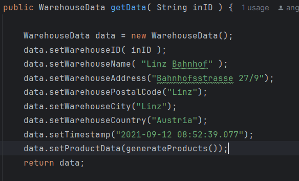
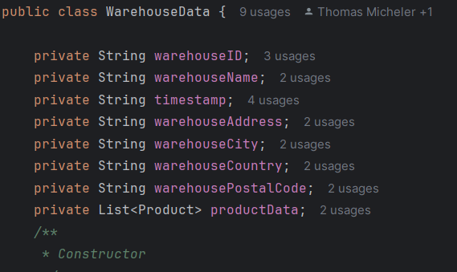
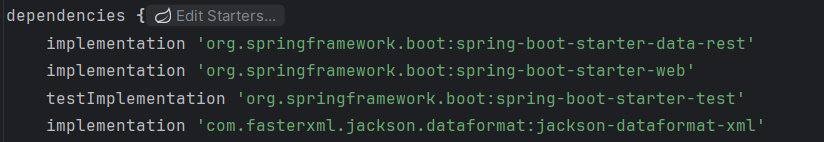
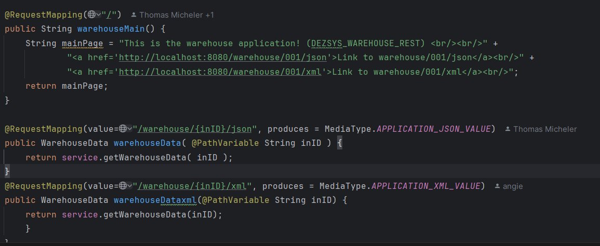

# Middleware Engineering "REST and Data Formats"

## Aufgabenstellung
Die Aufgabenstellung ist es um Standort- und Produktdaten in JSON und XML-Format darzustellen. 
## Implementierung
Zuerst hab ich entsprechend die WarehouseData und WarehouseSimulation um die Attribute Land, Stadt, usw. erweitert.

Dann habe ich eine Produktklasse erstellt und in WarehouseSimulation eine private Methode erstellt um Produkte zu generieren.
Und zuletzt habe ich den Controller erweitert, dass es XML unterstützt und hab auch entsprechend meine dependencies in Build file erweitert,
da ich davor damit Probleme hatte die XML-Datei auszuführen.

## Quellen
https://spring.io/guides/gs/rest-service/
